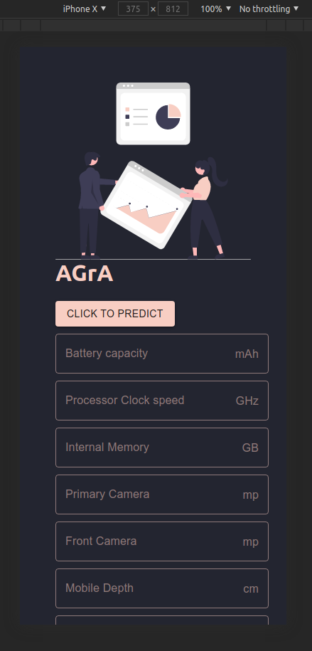

# Mobile-Price-Prediction
## About  
This repo contains code for an ML model for precicting the price of a mobile phone given a set of features it has
## How to get it running on your machine  
### Requirements  
- virtualenv (`sudo apt install virtualenv`)  
- React (`npm install React`)
- Flask (`pip install flask` after activating virtualenv)
- Material UI  (`npm install @material-ui/core`)  
### Step 1    
`virtualenv mpp`  
`cd mpp`  
`git clone https://github.com/A-Gr-A/Mobile-Price-Prediction`  
`cd Mobile-Price-Prediction/client`  
`npm start`  
### Step 2
Fire up a new terminal window(`ctrl`+`alt`+`T`)  
`cd mpp`  
`source ./bin/activate`  
`cd Mobile-Price-Prediction/backend`  
`pyton3 main.py`  

## Screenshots  

